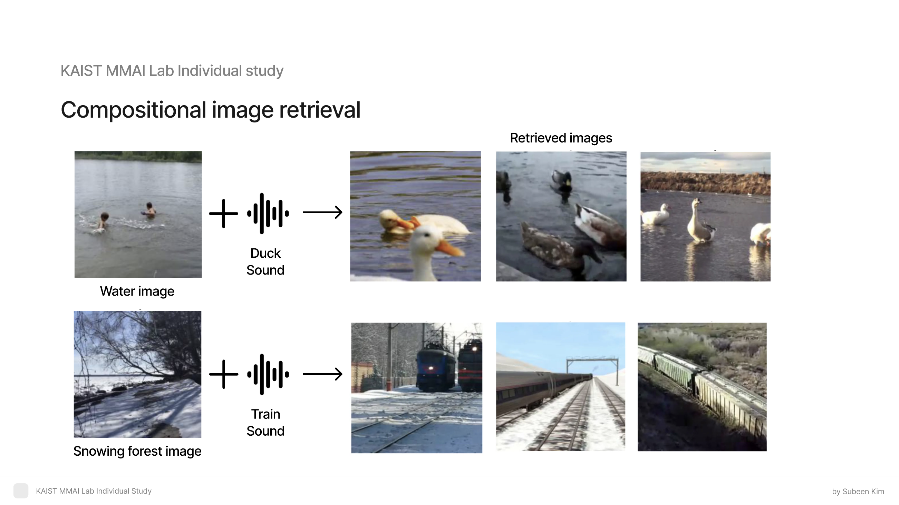

# 🔊🎥 Visual Sound Localization – Extended Implementation

This repository provides an extended and modular implementation of visual sound source localization. It builds upon [Localizing Visual Sounds the Hard Way](https://github.com/hche11/Localizing-Visual-Sounds-the-Hard-Way), with flexible training and testing pipelines, alternative dataset loaders, and structured experimentation scripts.

---

## Overview

The project focuses on multimodal audio-visual modeling, specifically targeting sound source localization from video using cross-modal representations. It supports training and evaluation on the VGG-SoundSource dataset and includes multiple loader variants and training pipelines.

---

## Project Slides (Figma)

For a high-level visual summary of the system architecture, data flow, and experimentation plan, refer to the following Figma board:

[](https://www.figma.com/deck/2Dd0OsIHjgfEAX1WT5teJ6)

↑ Click the image to open the full interactive board on Figma.

---

## Project Structure

### Training
- `train.py`: Original training code from the base implementation
- `train_baseline.py`: Baseline training pipeline with default settings
- `train_final_s_m.py`, `train_semantic_multiview.py`: Training scripts with semantic and multiview loss integration
- `train_localization.py`, `train_localization_2.py`: Training with localization loss objectives
- `train_multiview.py`: Training with multiview-only configuration

### Evaluation
- `test.py`: Evaluation script for trained models

### Dataset
- `DatasetLoader_origin.py`: Original dataset loader for VGGSoundSource
- `DatasetLoader_s_m.py`: Loader adapted for semantic & multiview supervision

### Utilities
- `topk_similarity.py`: Generates top-k similarity JSON outputs
- `utils.py`: General utility functions (logging, configuration, etc.)
- `practice_train.ipynb`: Testing Compositional image retrieval task

---

## 🚀 Getting Started

### 1. Clone the repository

```bash
git clone https://github.com/su-been-kim/MMAI_study.git
cd MMAI_study
```

---

### 2. Prepare the dataset

The project is built and tested using the **VGG-SoundSource** dataset.  
It is derived from the official [VGGSound Dataset](https://www.robots.ox.ac.uk/~vgg/data/vggsound/), provided by the Visual Geometry Group at the University of Oxford.

---

### 3. Example: Training with Semantic + Multiview Loss

You can launch training with semantic and multiview loss functions using the following command:

```bash
python train_final_s_m.py \                          # Main training script
  --exp_dir ./logs/exp1 \                            # Directory to save logs and checkpoints
  --init_lr 0.001 \                                  # Initial learning rate
  --epochs 60 \                                      # Number of training epochs
  --experiment_name 'exp1' \                         # Experiment name used for logging
  --gpu 0 \                                          # GPU device index to use
  --topk 100 \                                       # Top-K similar samples to consider
  --resume_path checkpoints/exp1/epoch_60.pth        # (Optional) Resume from existing checkpoint
```
